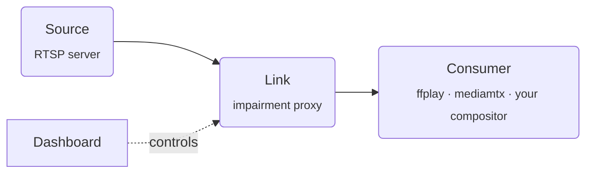
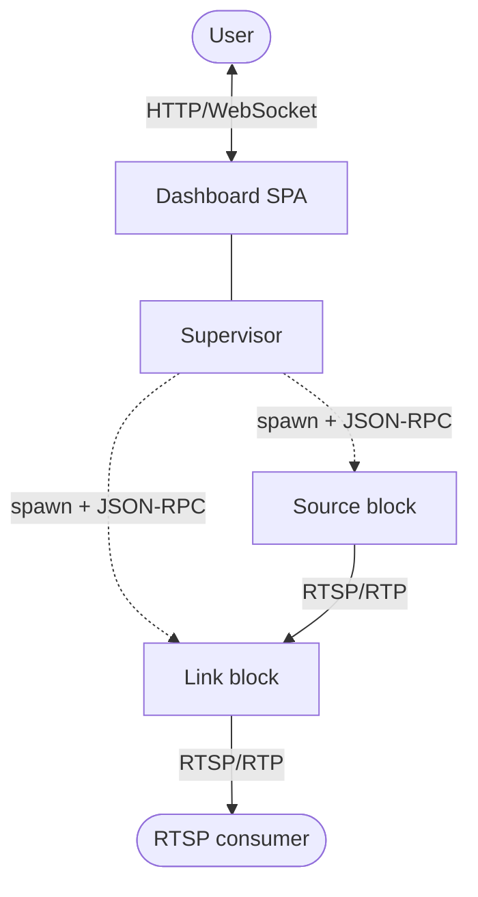

# chop

[](https://github.com/Moq77111113/chop/actions/workflows/ci.yml)
[](LICENSE)
[](go.mod)

> **chop** /tʃɒp/ _verb_ - to cut sharply into pieces. Named after what an unstable link does to your RTP stream: chop drops, delays, and slices packets on purpose so you can watch the result before your users do.

_chop_ is a local network impairment testbench for video pipelines. Spin up a synthetic RTSP camera (a **source**), insert a programmable proxy (a **link**) between it and your consumer, and degrade the network in real time from a dashboard. Packet loss, latency, jitter - all on a slider.

Because the only thing worse than a flaky network in production is finding out about it _from production_.

## Features

- **Synthetic source** - loops an H.264 file as an RTSP server, no encoder required.
- **Programmable link** - pulls upstream RTSP, applies impairments per RTP packet, serves clients downstream.
- **Live dashboard** - push controls in real time, see packet stats every second.
- **YAML scenarios** - declarative blocks, validated by `chop lint`.
- **Single binary** - Go server with the SolidJS dashboard embedded, nothing else to install.
- **Process-per-block** - crash isolation; future blocks plug in by speaking JSON-RPC over a pipe (Go, Rust, Python, anything that can write a line).

## Install

```bash
git clone https://github.com/Moq77111113/chop
cd chop
make build
```

Requirements: Go ≥ 1.26, Node + pnpm for the dashboard, ffmpeg + jq for the smoke fixture.

## Quick start

```bash
make fixture                              # generate a 5s test fixture
./chop run examples/smoke.yml             # supervisor + dashboard
ffplay rtsp://127.0.0.1:6720/cam1         # consume the impaired stream
```

Open `http://127.0.0.1:6700`, push the loss slider to 30%, and watch the picture turn into modern art.

## Scenario

A scenario is a YAML file describing which **blocks** to run and how they wire together. `chop run` starts the **supervisor**, which spawns each block, wires the dashboard, and serves it on `:6700`.

```yaml
name: smoke

blocks:
    - id: cam-1
      type: source
      config:
          file: testdata/pattern.h264
          listen: 127.0.0.1:6710
          fps: 30

    - id: link-1
      type: link
      config:
          upstream: rtsp://127.0.0.1:6710/cam1
          serve_at: 127.0.0.1:6720
      controls:
          loss: 0.0
```

`chop lint scenario.yml` validates it without spinning anything up.

## How it works



Each block runs in its own OS process. The supervisor talks to them over stdio JSON-RPC and exposes an HTTP/WebSocket API for the dashboard. Crash isolation comes for free - one block panicking doesn't take everyone down with it.



```
chop/
├── block/                # public framework surface
├── internal/blocks/      # built-in block types (source, link, …)
├── internal/supervisor/  # spawn + lifecycle + HTTP/WebSocket
├── internal/scenario/    # YAML loader
├── web/                  # SolidJS dashboard (embedded)
└── cmd/chop/             # CLI
```

`block/` is the only public package - that's the contract for adding your own.

## Coming soon

- Full impairment toolkit - latency, jitter, bandwidth (token bucket).
- TCP-interleaved transport for clients allergic to UDP.
- Per-packet event feed for forensic replay of degraded sessions.
- DAG scenarios with declarative dependencies and readiness gates.
- A `process` block to wrap external binaries (mediamtx, GStreamer, FFmpeg) under the same control surface.

## What chop is not

- A production proxy. It's a test harness - don't put it on the wire path.
- A kernel-level network simulator. Use `tc netem` or `clumsy` for that.
- A media server. mediamtx and GStreamer do that. chop wraps and chops them.
